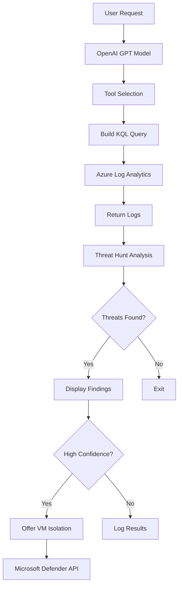

# 🔥 Agentic AI SOC Analyst & Threat Hunter

> *"AI will replace bad SOC analysts. Not good ones."*

Hours of manual work, done in minutes. This agentic system operates across your entire threat surface — autonomously hunting, scoring, documenting, and acting — without waiting for a human to notice something is wrong.

---

## What It Does

Traditional SOC workflows are slow by design. An alert fires, a ticket opens, an analyst triages it — maybe hours later. This system collapses that timeline to seconds.

- **Threat hunting** across Azure Log Analytics, continuously scanning for indicators of compromise and suspicious behavioral patterns
- **Intelligent prioritization** using confidence-based scoring to surface what actually matters, cutting through thousands of daily alerts
- **MITRE ATT&CK mapping** — every finding is automatically cross-referenced against the ATT&CK framework, giving analysts immediate context on tactics, techniques, and procedures
- **Auto-generated investigation reports** with timeline reconstructions, affected asset summaries, and recommended remediation steps
- **Automated VM isolation** — when a compromised endpoint is identified, the system can act immediately, with a human-in-the-loop approval step before execution

Faster than any junior analyst. Every time. Without fatigue, without bias, without missing shift handoffs.

---

## How the Pipeline Works

1. **Ingest** — Continuous log ingestion from Azure Log Analytics, endpoint telemetry, and network flows
2. **Detect** — Behavioral analytics and rule-based detections fire across normalized event data
3. **Score** — Each alert is assigned a confidence score weighted by severity, asset criticality, and historical context
4. **Investigate** — The agent autonomously pivots across related events, builds an attack timeline, and maps to MITRE ATT&CK
5. **Document** — A full incident report is generated before a human even opens the ticket
6. **Respond** — Containment actions (like VM isolation) are queued for analyst approval, or auto-executed based on policy thresholds

---

## The Uncomfortable Truth About Entry-Level Roles

Entry-level SOC seats are shrinking — not because threats are disappearing, but because AI now handles the workload that used to require multiple analysts per shift. Alert triage, log correlation, basic threat research, and first-pass documentation are all being absorbed.

This isn't speculation. It's already happening.

The question isn't *if* this changes headcount. It's *who adapts fast enough* to stay ahead of it.

---

## What the Future SOC Looks Like

The team doesn't disappear — it evolves. The ratio shifts. Fewer people handling more, at higher quality, with AI doing the heavy lifting on volume.

| Layer | Owner | Why |
|---|---|---|
| Alert triage & noise filtering | AI | Speed and scale at volume humans can't match |
| Log correlation & pattern detection | AI | Consistent, tireless, cross-source |
| Threat intelligence enrichment | AI | Automated lookups across feeds and CVE databases |
| Adversary modeling & intuition | Human | Context, creativity, and attacker psychology |
| Incident command & communication | Human | Stakeholder trust requires human accountability |
| Red team strategy & hunt hypothesis | Human | Offensive thinking AI still can't replicate |

---

## Who Thrives in This New SOC

The analysts who win aren't the ones who resist the shift — they're the ones who learn to direct it. Think of it less like being replaced and more like being promoted out of the manual work.

The skills that matter going forward:

- **Prompt engineering for security** — knowing how to query and direct AI agents effectively
- **Hunt hypothesis development** — designing the questions the AI goes looking for answers to
- **Adversary emulation** — understanding attacker behavior deeply enough to validate what the AI surfaces
- **IR command** — leading response operations where AI handles execution and humans handle judgment
- **Tuning and oversight** — catching when the model is wrong, drifting, or being actively deceived

The click-next analyst era is ending. The AI-augmented analyst era is already here.

---

## Bottom Line

This isn't a tool that assists analysts. It's a system that *operates independently* and surfaces work for humans to approve, escalate, or close. The bar for what a SOC analyst needs to bring to the table just got significantly higher — and the organizations that deploy this well will run leaner, faster, and with better detection coverage than those that don't.

**The threat landscape isn't slowing down. Neither should your SOC.**


## 💥 The Controversial Part

* Companies won't need as many entry-level analysts — **AI will fill that gap**.
* The analysts who thrive will be those who **leverage AI as a partner, not compete with it**.

---

## 🎥 Demo

Check out the demo video of the Agentic AI in action — doing the work *with me*, not *for me*.

---

## 🏗️ Architecture



---

## 🚀 Features

- **Intelligent Query Building**: Automatically constructs KQL queries based on natural language requests
- **Multi-Table Support**: Queries multiple MDE tables including DeviceProcessEvents, DeviceNetworkEvents, DeviceLogonEvents, and more
- **MITRE ATT&CK Mapping**: Every finding is mapped to MITRE tactics, techniques, and sub-techniques
- **Confidence Scoring**: Findings are rated Low/Medium/High confidence to help prioritize response
- **IOC Extraction**: Automatically extracts Indicators of Compromise (IPs, domains, hashes, filenames)
- **Guardrails**: Built-in validation for tables, fields, and models to prevent unauthorized operations
- **Cost Awareness**: Tracks token usage and estimates costs before running expensive queries
- **Automated Response**: Can isolate compromised VMs via Microsoft Defender for Endpoint API

---

## 📋 Prerequisites

- Python 3.10+
- Azure subscription with Log Analytics Workspace
- Microsoft Defender for Endpoint (optional, for VM isolation)
- OpenAI API key

---

## ⚙️ Installation

1. **Clone the repository**
   ```bash
   git clone https://github.com/AnandSundar/Cyber-AI-Agent.git
   cd Cyber-AI-Agent
   ```

2. **Install dependencies**
   ```bash
   pip install -r requirements.txt
   ```

3. **Configure environment variables**
   
   Create a `.env` file in the project root:
   ```env
   OPENAI_API_KEY=your_openai_api_key
   LOG_ANALYTICS_WORKSPACE_ID=your_workspace_id
   ```

4. **Authenticate with Azure**
   ```bash
   az login
   ```

---

## 🎮 Usage

Run the main script:
```bash
python _main.py
```

You'll be prompted to describe what you want to hunt for. Example:
```
I'm worried that windows-target-1 might have been maliciously logged into in the last few days
```

The AI will:
1. Analyze your request and select appropriate log tables
2. Build and execute a KQL query against Azure Log Analytics
3. Analyze the returned logs for threats
4. Present findings with MITRE ATT&CK mapping and recommendations
5. Offer to isolate VMs if high-confidence threats are detected

---

## 📁 Project Structure

```
Cyber-AI-Agent/
├── _main.py              # Main entry point - orchestrates the threat hunt
├── executor.py           # Core execution logic for queries and API calls
├── guardrails.py         # Validation for tables, fields, and models
├── model_management.py   # OpenAI model selection and token management
├── prompt_management.py  # System prompts and threat hunt templates
├── utilities.py          # Helper functions for display and sanitization
├── requirements.txt      # Python dependencies
└── .env                  # Environment configuration (not in repo)
```

---

## 🗂️ Supported Log Tables

| Table | Description |
|-------|-------------|
| `DeviceProcessEvents` | Process execution events |
| `DeviceNetworkEvents` | Network connection events |
| `DeviceLogonEvents` | Logon/logoff events |
| `DeviceFileEvents` | File creation/modification events |
| `DeviceRegistryEvents` | Registry modification events |
| `AzureNetworkAnalytics_CL` | Azure network flow logs |
| `AzureActivity` | Azure activity logs |
| `SigninLogs` | Azure AD sign-in logs |

---

## 🤖 Supported Models

| Model | Max Input | Cost (Input/Output per 1M tokens) |
|-------|-----------|-----------------------------------|
| gpt-4.1-nano | 1,047,576 | $0.10 / $0.40 |
| gpt-4.1 | 1,047,576 | $1.00 / $8.00 |
| gpt-5-mini | 272,000 | $0.25 / $2.00 |
| gpt-5 | 272,000 | $1.25 / $10.00 |

---

## 🛡️ MITRE ATT&CK Coverage

This tool can detect and map findings to all 14 MITRE ATT&CK tactics:

| Tactic | Description |
|--------|-------------|
| 🔎 Reconnaissance | Gathering information before attack |
| 🛠️ Resource Development | Setting up attack infrastructure |
| 🚪 Initial Access | First foothold in environment |
| ⚡ Execution | Running malicious code |
| 🔄 Persistence | Maintaining long-term access |
| 📈 Privilege Escalation | Gaining higher permissions |
| 🕵️ Defense Evasion | Avoiding detection |
| 🔑 Credential Access | Stealing credentials |
| 🗺️ Discovery | Mapping the environment |
| 🔄 Lateral Movement | Moving between systems |
| 📥 Collection | Gathering valuable data |
| 🌐 Command and Control | Controlling compromised systems |
| 📤 Exfiltration | Stealing data out |
| 💣 Impact | Final damage stage |

---

## 📊 Example Output

```
Cognitive hunt complete. Took 12.34 seconds and found 3 potential threat(s)!

┌─────────────────────────────────────────────────────────────┐
│ THREAT 1: Suspicious PowerShell Execution                   │
├─────────────────────────────────────────────────────────────┤
│ Confidence: HIGH                                             │
│ MITRE: T1059.001 - Command and Scripting Interpreter        │
│ Description: Encoded PowerShell command detected...         │
│ IOCs: 192.168.1.100, malicious.exe                          │
│ Recommendations: [pivot, create incident]                   │
└─────────────────────────────────────────────────────────────┘
```

---

## 🔒 Security Considerations

- **Guardrails**: All queries are validated against allowed tables and fields
- **Model Validation**: Only approved OpenAI models can be used
- **User Approval**: VM isolation requires explicit user confirmation
- **No Data Exfiltration**: Logs are analyzed locally via API, not stored

---

## 💭 What do you think?

* Is AI going to be the **end of SOC analyst jobs**?
* Or is it the **biggest upgrade our industry has ever seen**?

---

## 🤝 Contributing

Contributions are welcome! Please feel free to submit a Pull Request.

---

## 📄 License

This project is licensed under the MIT License - see the LICENSE file for details.

---

## 🙏 Acknowledgments

- OpenAI for GPT models
- Microsoft for Azure Log Analytics and Defender for Endpoint
- MITRE Corporation for the ATT&CK framework

---

### 🔗 Tags

`#SOC` `#ThreatHunting` `#AI` `#Cybersecurity` `#OpenAI` `#Azure` `#MicrosoftDefender` `#MITRE` `#Automation`

---

Youtube Video: [https://www.youtube.com/watch?v=vFuM--0H3qE](https://www.youtube.com/watch?v=oWa5Wxb8w-o)
